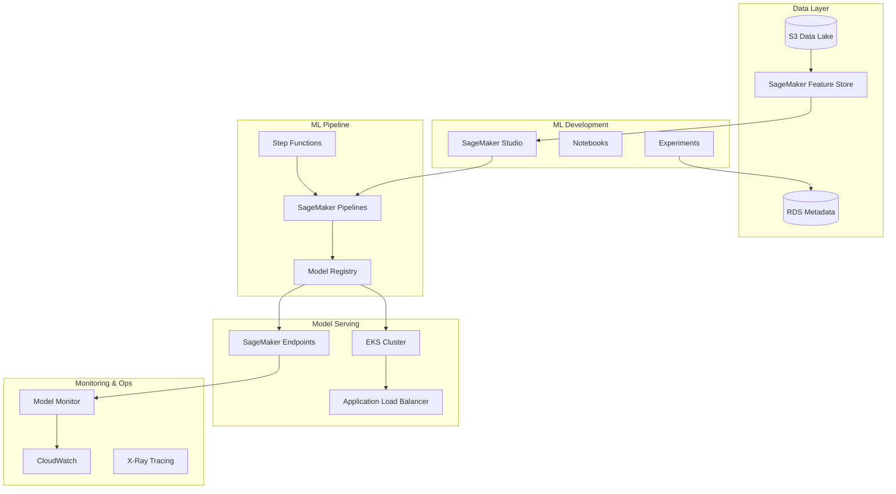
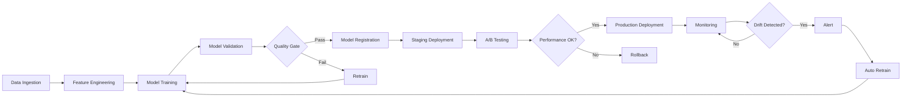

# 🤖 MLOps Platform on AWS

[](https://github.com/melorga/ml-platform-aws)
[](https://terraform.io)
[](https://aws.amazon.com/sagemaker/)
[](https://aws.amazon.com/eks/)

A comprehensive, enterprise-grade MLOps platform built on AWS services that demonstrates end-to-end machine learning lifecycle management with automated training, validation, deployment, and monitoring.

## 🏗️ Architecture Overview



## 🔄 ML Lifecycle Management



## 🎯 Key Features

### 🔧 **Infrastructure as Code**
- Complete Terraform modules for all AWS ML services
- Multi-environment support (dev/stage/prod)
- Automated resource provisioning and scaling

### 🤖 **Automated ML Pipelines**
- SageMaker Pipelines for training workflows
- Step Functions for complex orchestration
- EventBridge-triggered automated retraining

### 📊 **Model Management**
- Centralized model registry with versioning
- A/B testing infrastructure
- Blue/green deployment strategies

### 📈 **Monitoring & Observability**
- Real-time model performance monitoring
- Data drift detection and alerting
- Comprehensive logging and tracing

### 🔒 **Security & Compliance**
- IAM roles with principle of least privilege
- VPC isolation and network security
- Encryption at rest and in transit

## 📁 Repository Structure

```
ml-platform-aws/
├── modules/
│   ├── sagemaker-platform/     # Core SageMaker infrastructure
│   ├── ml-pipelines/           # Training and inference pipelines
│   └── model-serving/          # Model deployment infrastructure
├── infrastructure/
│   ├── environments/
│   │   ├── dev/               # Development environment
│   │   ├── stage/             # Staging environment
│   │   └── prod/              # Production environment
│   └── shared/                # Shared resources
├── examples/
│   ├── end-to-end-ml-pipeline/ # Complete ML workflow example
│   └── model-deployment/       # Model serving examples
├── docs/
│   ├── architecture/          # Architecture documentation
│   └── tutorials/             # Step-by-step guides
├── scripts/                   # Utility scripts
└── tests/                     # Infrastructure tests
```

## 🚀 Quick Start

### Prerequisites
- AWS CLI configured with appropriate permissions
- Terraform >= 1.8.0
- Docker (for local testing)
- Python 3.9+ (for Lambda functions)

### 1. Deploy Core Infrastructure

```bash
# Clone the repository
git clone https://github.com/melorga/ml-platform-aws.git
cd ml-platform-aws

# Deploy to development environment
cd infrastructure/environments/dev
terraform init
terraform plan
terraform apply
```

### 2. Run Example ML Pipeline

```bash
# Deploy example pipeline
cd examples/end-to-end-ml-pipeline
terraform init
terraform apply

# Execute training pipeline
aws stepfunctions start-execution \
  --state-machine-arn $(terraform output pipeline_arn) \
  --input '{}'
```

### 3. Monitor Pipeline Execution

```bash
# View pipeline status
aws stepfunctions describe-execution \
  --execution-arn <execution-arn>

# Check model registry
aws sagemaker list-model-packages \
  --model-package-group-name demo-model-group
```

## 🛠️ Infrastructure Modules

### SageMaker Platform Module

**Location**: `modules/sagemaker-platform/`

**Components**:
- SageMaker Studio Domain with user profiles
- Feature Store for feature management
- Model Registry for model versioning
- Processing and training job configurations

### ML Pipelines Module

**Location**: `modules/ml-pipelines/`

**Components**:
- Step Functions state machines
- SageMaker Pipeline definitions
- EventBridge rules for automation
- Lambda functions for orchestration

### Model Serving Module

**Location**: `modules/model-serving/`

**Components**:
- SageMaker real-time endpoints
- EKS cluster for batch inference
- Auto-scaling configurations
- Load balancers and networking

## 📊 Cost Optimization

### Estimated Monthly Costs (USD)

| Component | Dev | Stage | Prod |
|-----------|-----|-------|------|
| SageMaker Studio | $50 | $100 | $200 |
| Training Jobs | $100 | $300 | $800 |
| Endpoints | $200 | $500 | $1,500 |
| EKS Cluster | $150 | $300 | $600 |
| Storage (S3/EFS) | $20 | $50 | $150 |
| **Total** | **$520** | **$1,250** | **$3,250** |

### Cost Optimization Features
- Spot instances for training jobs
- Auto-scaling for endpoints
- Lifecycle policies for data storage
- Scheduled shutdown for development resources

## 🔐 Security Features

- **Identity & Access Management**
  - Fine-grained IAM roles and policies
  - Resource-based permissions
  - Cross-account access controls

- **Network Security**
  - VPC isolation with private subnets
  - Security groups and NACLs
  - VPC endpoints for AWS services

- **Data Protection**
  - Encryption at rest (S3, EBS, RDS)
  - Encryption in transit (TLS/SSL)
  - Key management with AWS KMS

- **Compliance**
  - CloudTrail logging
  - Config rules for compliance monitoring
  - GuardDuty for threat detection

## 📈 Performance Metrics

### Training Performance
- **Model Training Time**: 15-45 minutes (depending on data size)
- **Pipeline Execution Time**: 2-8 hours (end-to-end)
- **Resource Utilization**: 85-95% (optimized instance types)

### Inference Performance
- **Real-time Latency**: <100ms (P99)
- **Batch Throughput**: 10K+ predictions/minute
- **Availability**: 99.9% SLA

## 🧪 Testing

```bash
# Run infrastructure tests
cd tests
go test -v ./...

# Run integration tests
python -m pytest tests/integration/

# Performance testing
cd scripts
./load_test.sh
```

## 📚 Documentation

- [Architecture Deep Dive](docs/architecture/README.md)
- [Deployment Guide](docs/tutorials/deployment.md)
- [ML Pipeline Tutorial](docs/tutorials/ml-pipeline.md)
- [Monitoring Guide](docs/tutorials/monitoring.md)
- [Troubleshooting](docs/tutorials/troubleshooting.md)

## 🤝 Contributing

1. Fork the repository
2. Create a feature branch
3. Make your changes
4. Add tests for new functionality
5. Run the test suite
6. Submit a pull request

## 📄 License

This project is licensed under the MIT License - see the [LICENSE](LICENSE) file for details.

## 🏆 Portfolio Impact

This MLOps platform demonstrates:

✅ **Enterprise-grade ML infrastructure** design and implementation  
✅ **Advanced AWS services integration** (SageMaker, EKS, Step Functions)  
✅ **Infrastructure as Code** best practices with Terraform  
✅ **MLOps pipeline automation** with CI/CD integration  
✅ **Cost optimization** and performance engineering  
✅ **Security and compliance** in ML workloads  

---

**Built with ❤️ by [melorga](https://github.com/melorga) as part of an advanced AWS Solutions Architect portfolio**
